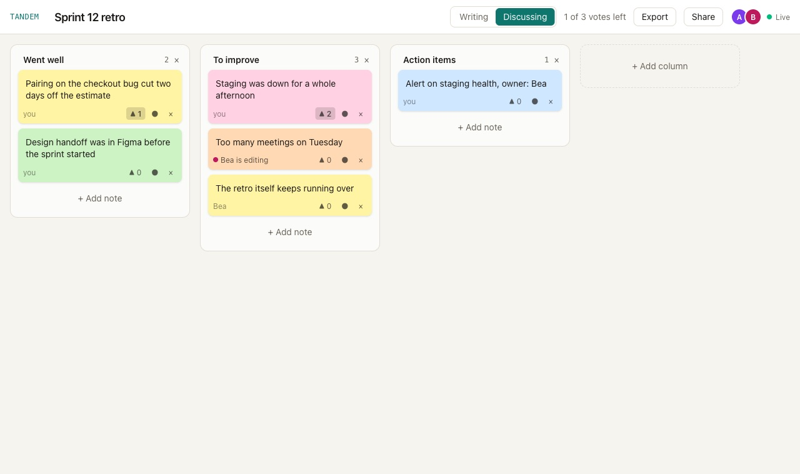

<p align="center">
  
</p>

<h1 align="center">Tandem</h1>

<p align="center">
  A realtime board for retros and brainstorms.<br>
  <sub>React 19 · TypeScript · WebSockets · Node 24 · SQLite, no ORM</sub>
</p>

<br>

Sticky notes, columns, votes and live cursors for everyone with the link.
People write in private first, so nobody anchors on the first card; then the
board is revealed, votes open, and the result exports as markdown. The name
is the point of it: several people working on one board in tandem.

The part I built it for is underneath: a sync protocol you can read in one
sitting. No CRDT library, no Firebase. Every change is an op, the server
orders them, and each client replays its own unconfirmed ops on top of what
the server confirmed. That is why an edit shows up instantly, survives a lost
connection, and ends up identical on every screen.



## Running it

You need Node 24 (`nvm use` reads the `.nvmrc`; `node:sqlite` needs it). No
database to install: the server keeps a SQLite file in `data/`. It takes two
terminals.

1. Clone and install:

   ```bash
   git clone https://github.com/Brunoskyy/tandem.git && cd tandem
   nvm use
   npm install
   ```

2. **Terminal 1, from the repo root:** the API and WebSocket server, on port 8787.

   ```bash
   npm run dev -w server
   ```

3. **Terminal 2, from the repo root:** the web app, on port 5173. It proxies
   `/api` and `/ws` to the server.

   ```bash
   npm run dev -w web
   ```

4. Open http://localhost:5173, create a board, and open its link in a private
   window too, so the second window joins as another person.

Stop with Ctrl+C in both terminals. To start over, delete the `data/` folder.

| Command (repo root) | |
| --- | --- |
| `npm test` | all three workspaces |
| `npm run typecheck` | `tsc` per workspace |
| `npm run build && npm start` | production: one process on port 8787 serves the API, the sockets and the built client |
| `docker build -t tandem . && docker run -p 8787:8787 -v tandem:/data tandem` | the same, in a container |

To deploy, anything that runs a container with a volume works; there is a
`fly.toml` (`fly launch --copy-config`, then `fly deploy`). Static hosts like
Vercel won't, because the sockets need a process that stays up.

## How the sync works

```
client                          server                         other clients
  │ apply op locally               │                                │
  │ ──── op ─────────────────────▶ │ validate, pin actor            │
  │      (kept in pending[])       │ seq = n+1, append to log       │
  │ ◀─── ops [{seq, op}] ───────── │ ──── ops [{seq, op}] ────────▶ │ apply
  │ apply to confirmed,            │                                │
  │ drop from pending              │                                │
```

- **Every change is an op.** `applyOp` in `shared/src/ops.ts` is pure and
  idempotent; stale ops (a note already deleted) are no-ops, because with
  several editors they are normal.
- **The server is the clock.** One room per board, one thread, a sequence
  number per op. "Last writer wins" means "the op the server saw last".
- **Clients are optimistic.** The view is `pending` replayed over `confirmed`,
  so our own edits show at once and don't flicker when the server confirms them.
- **Reconnects are boring.** Pending ops live in `localStorage` and are resent
  on reconnect; the server ignores op ids it already applied.
- **Positions are fractional,** so a drag never moves anyone else's card, and
  the column is spread back out when doubles run out of room.
- **Votes are a set per participant,** with the per-person cap checked in
  `applyOp`, so it holds whatever order the server picks.

## Things worth opening

- **`shared/src/validate.ts`:** hand-written parsers for the nine op shapes.
  The actor of an op is whoever joined on that socket, whatever the message claims.
- **`web/src/sync/store.ts`:** the confirmed/pending split in about 150 lines,
  tested with a fake socket that drops and comes back.
- **`web/src/components/Board.tsx`:** drag and drop with pointer events and no
  library; Alt with an arrow key does the same from the keyboard.
- **`server/src/store.ts`:** a snapshot plus the ops since it, in SQLite, so a
  restart replays the tail.

## Tests

52 tests, run with `npm test` from the repo root. Shared logic as pure
functions (concurrent edits in both orders, the vote cap, validation); server
tests over real sockets on a random port (convergence, late joiners, duplicate
and spoofed ops, rate limiting, a restart mid-board); client tests that script
the connection going away and coming back.

## Layout

```
shared/src/   types, applyOp, fractional order, validation, protocol
server/src/   rooms, SQLite store, WebSocket handshake, HTTP and export
web/src/      sync (connection and store), components, drag and drop
```

## What's missing

- No accounts: whoever has the link is in.
- Text conflicts are last-writer-wins per note, not per character; the
  "is editing" hint makes a lost edit rare, not impossible.
- Boards are never deleted, and there is no shared timer yet.
